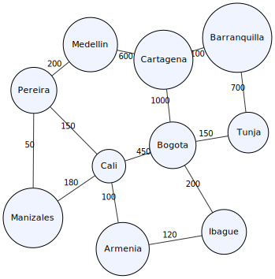

# Algoritmo de Dijkstra en el Mapa de Colombia

Este proyecto implementa el algoritmo de Dijkstra utilizando listas de adyacencia (ArrayList - LinkedList - List) para encontrar caminos más cortos en el mapa de Colombia, desde Cali hasta Cartagena. Incluye la búsqueda de todos los caminos posibles, su ordenamiento y la selección del menor recorrido.

## Descripción del Proyecto

- **Algoritmo Principal**: Dijkstra para caminos más cortos.
- **Estructura de Datos**: Grafo no dirigido con listas de adyacencia usando LinkedList.
- **Mapa**: Ciudades de Colombia con distancias aproximadas en km.
- **Funcionalidades**:
  - Encontrar todos los caminos de Cali a Cartagena.
  - Ordenar los caminos por distancia usando el método de burbuja.
  - Mostrar el camino con la menor distancia.

## Diagrama del Grafo

El grafo representa las conexiones entre las siguientes ciudades:
- Cali (origen)
- Pereira
- Manizales
- Armenia
- Ibagué
- Bogotá
- Tunja
- Barranquilla
- Medellín
- Cartagena (destino)



## Archivos

- `Dijkstra.java`: Implementación del algoritmo de Dijkstra, búsqueda de caminos y ordenamiento.
- `Grafo.java`: Representación del grafo con listas de adyacencia.
- `Grafo.svg`: Diagrama visual del grafo.
- `README.md`: Este archivo.

## Cómo Ejecutar

1. Compilar los archivos Java:
   ```
   javac Dijkstra.java Grafo.java
   ```

2. Ejecutar el programa:
   ```
   java Dijkstra
   ```

## Salida del Programa

El programa mostrará todos los caminos encontrados de Cali a Cartagena, ordenados por distancia, y destacará el camino con la menor distancia.

## Enlace de GitHub

[Repositorio en GitHub](https://github.com/S4nt14g033/Programacion-III/tree/main/Algoritmo%20Colombia)

## Guía para Video de 3 Minutos

### Estructura del Video:

1. **Introducción (30 segundos)**:
   - Presentar el proyecto: "Hoy implementamos el algoritmo de Dijkstra en el mapa de Colombia para encontrar caminos de Cali a Cartagena."
   - Mostrar el diagrama del grafo.

2. **Explicación del Grafo (45 segundos)**:
   - Describir las ciudades y conexiones.
   - Explicar listas de adyacencia con LinkedList.

3. **Algoritmo de Dijkstra (45 segundos)**:
   - Explicar cómo funciona Dijkstra para caminos más cortos.
   - Mostrar el código relevante.

4. **Búsqueda de Caminos y Ordenamiento (45 segundos)**:
   - Explicar DFS para encontrar todos los caminos.
   - Mostrar el método de ordenamiento burbuja.

5. **Ejecución y Resultados (30 segundos)**:
   - Ejecutar el programa y mostrar la salida.
   - Destacar el camino más corto.

6. **Conclusión (15 segundos)**:
   - Resumir lo aprendido y enlace al repositorio.

### Consejos para el Video:
- Usar animaciones para el grafo y algoritmo.
- Hablar claro y pausado.
- Mostrar código en pantalla.
- Enfocarse en conceptos clave sin detalles técnicos excesivos.
